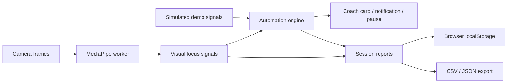

<div align="center">

# 🌿 Attn

### Your personal focus coach

Turn focus sessions into useful insights with on-device vision, configurable automations, and a private reporting dashboard.

[](https://ai-attention.nishwanthyarra.workers.dev/)


[Quick start](#quick-start) · [Automations](#automations) · [Architecture](#architecture) · [Deployment](#deployment)

*Designed for intention, not perfection.*

</div>

## Overview

**Attn** is a browser-first focus coach built as an automation engineering showcase. Set an intention, start a timed session, and receive gentle coaching when sustained visual cues trigger your rules. Review your session afterward through a dashboard with timelines, focus estimates, and automation activity.

Camera processing runs on your device. The application is a static React site with no backend service, account, database server, or paid API requirement.

> **Explore the live application:** [ai-attention.nishwanthyarra.workers.dev](https://ai-attention.nishwanthyarra.workers.dev/)
>
> Choose **Try a demo first** for a camera-free walkthrough. Simulated signals drive the real automation engine, and demo reports are clearly labeled.

## Features

| Feature | What you can do |
| --- | --- |
| **Focus workspace** | Set a session intention, choose a 15-, 25-, or 50-minute goal, and pause or resume your session. |
| **On-device vision** | View camera-based gaze, head alignment, and eye-openness cues alongside a live signal timeline. |
| **Configurable automations** | Adjust thresholds, trigger durations, cooldowns, actions, and rule enablement. |
| **Coaching actions** | Display an in-app coach card, request a desktop notification, or pause the session automatically. |
| **Reporting dashboard** | Review average signal, observed focused time, longest streak, session timelines, and automation activity. |
| **Portable reports** | Export timeline data as CSV and report data as JSON; filter camera and demo sessions. |
| **Privacy controls** | Opt into camera access and notifications, keep reports locally, and clear stored data. |

## Automations

Rules use sustained conditions and cooldowns to avoid reacting to every momentary change. These are the default configurations; their settings and actions can be adjusted in the application.

| Rule | Default trigger | Default action | Cooldown |
| --- | --- | --- | --- |
| **A gentle nudge** | Focus signal below 50 for 6 seconds | Coach card | 45 seconds |
| **Step away, guilt-free** | No face detected for 12 seconds | Pause session | 60 seconds |
| **Make room for a break** | 20-minute interval | Coach card | 60 seconds |
| **Celebrate your flow** | Focus signal at or above 75 for 60 seconds | Coach card | 5 minutes |

Each execution appears in the activity log. Reaching the session goal automatically finishes the session and saves a report.

**Runtime:** coaching runs during an active session while the tab is visible. Hiding the tab pauses coaching. These automations operate in the browser and do not run as unattended cloud jobs.

## Quick start

Use **Node.js 22** (or a supported version satisfying Node.js 20.19+) and npm. From the repository root:

```sh
npm --prefix frontend ci
npm run dev
```

Open [localhost:5173](http://localhost:5173) and choose a camera session or **Try a demo first**.

| Command | Purpose |
| --- | --- |
| `npm run dev` | Start the local development server. |
| `npm test` | Run the core logic tests. |
| `npm run build` | Generate the production site in `frontend/dist`. |
| `npm run preview` | Preview the production build locally. |

The previous Python application is preserved in `legacy/`. The current application runs from `frontend/` and does not require Python or a GPU.

## Architecture



A dedicated worker processes one camera frame at a time, keeping inference off the UI thread. The application combines gaze alignment (45%), head alignment (35%), and eye openness (20%) into a heuristic signal, sampled once per second for reports and rule evaluation.

| Layer | Technology |
| --- | --- |
| Interface | React 19, responsive CSS |
| Build tooling | Vite 8 |
| Vision | MediaPipe Face Landmarker in a dedicated worker |
| Automation | JavaScript rule engine with sustained triggers and cooldowns |
| Persistence | Browser localStorage |
| Testing | Node.js built-in test runner |
| Hosting | Cloudflare Workers static assets |

See [architecture notes](docs/ARCHITECTURE.md) for implementation details and tradeoffs.

### Project structure

```text
AI-Attention/
├── frontend/
│   ├── src/
│   │   ├── core/                 # Rules, session aggregates, storage
│   │   ├── features/
│   │   │   ├── focus/            # Camera lifecycle and focus workspace
│   │   │   ├── automations/      # Rule editor and execution log
│   │   │   └── reports/          # Dashboard, exports, privacy settings
│   │   └── ui/                   # Shared interface components
│   ├── public/vision-worker.js   # MediaPipe inference worker
│   └── tests/                    # Logic tests and model smoke check
├── docs/                         # Architecture, deployment, validation
├── legacy/                       # Archived Python and earlier UI code
├── .github/workflows/ci.yml       # Automated test and build workflow
├── Dockerfile                    # Alternative static-site container
└── package.json                  # Root development commands
```

## Deployment

The live application is hosted on **Cloudflare Workers**:

**[Launch Attn →](https://ai-attention.nishwanthyarra.workers.dev/)**

For the current repository layout, use these Workers build settings:

| Setting | Value |
| --- | --- |
| Root directory | `/` (repository root) |
| Build command | `npm --prefix frontend ci && npm run build` |
| Deploy command | `npx wrangler deploy --name ai-attention --assets ./frontend/dist --compatibility-date 2026-09-23` |

The build installs the frontend dependencies and produces the static bundle. The deploy command supplies the Worker name, assets directory, and required compatibility date. If deploying your own copy, replace `ai-attention` with your Worker name.

Use `npm run build` for production; `npm run dev` starts a development server. See the [deployment guide](docs/DEPLOYMENT.md) for alternative static hosting and Docker options.

## Privacy and limitations

- **Video stays on the device.** Camera frames are processed locally and are not uploaded by the application.
- **Initial model loading uses the network.** MediaPipe JavaScript/WASM loads from jsDelivr, the model loads from Google Cloud Storage, and fonts load from Google Fonts.
- **Reports belong to this browser.** The latest 30 completed reports and rule preferences are stored in localStorage for the current domain. There is no cross-device sync; export reports before clearing browser data.
- **Finish before refreshing.** An unfinished session is held in memory and is not restored after a refresh.
- **Camera access needs permission.** Use HTTPS or localhost and a compatible browser. Desktop notifications also require browser permission.
- **The signal is an estimate.** Visual alignment does not establish attention, thoughts, productivity, or a medical condition. This project is a personal experiment and engineering showcase, not an employee or student assessment tool.

## Validation

The core suite contains 15 tests covering automation and session logic. Production builds and browser demo flows have also been checked. Tests do not establish real-world webcam accuracy or guarantee notification delivery on every device.

```sh
npm test
npm run build
```

Read the [validation notes](docs/VALIDATION.md) for the checks performed and remaining manual checks.

---

<div align="center">

**A small intention. A focused session. A useful report.**

[Try Attn live](https://ai-attention.nishwanthyarra.workers.dev/)

</div>
