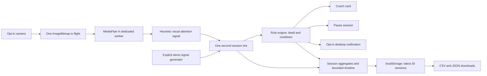

# Architecture

No camera pixels, landmarks, or session reports are sent to an application backend.
Model assets and fonts are external downloads. Reports contain numeric scores and event
metadata, not images or facial landmarks. Each visitor has an independent browser state.

`AutomationEngine` is a pure evaluator except for event IDs/timestamps. Elapsed session
time is injected, enabling deterministic dwell/cooldown tests. Configuration changes
invalidate a rule's timing state. Disabling a rule removes its continuity. Pausing resets
dwell continuity while retaining cooldown history. Periodic rules emit at most one action
per evaluation and never replay a burst for missed intervals.

`useFocus` owns lifecycle and effect delivery. `useCamera` owns worker and MediaStream
cleanup. A canceled startup cannot retain a late camera stream. Inference processes
one transferable ImageBitmap at a time; errors and watchdog timeouts pause the session.
The worker explicitly closes transferred bitmaps. A new camera session or resume loads
a fresh worker; browser caching reduces subsequent model download work.

Reports retain up to 7,200 one-second samples per session and 300 automation events.
Aggregates cover all observations. The chart downsamples to at most about 180 vertices.
A device suspension longer than five seconds pauses; stale camera metrics are not credited.

## Intentional scope

There are four editable starter rules, not a generic arbitrary-code workflow builder.
Actions are local UI/notification/pause effects. There are no hidden email, Slack,
webhook, or paid-API integrations. Browser notifications are user-opt-in; if unavailable,
the coach card is shown and the execution log records the fallback.

No login, shared server database, scheduled server jobs, or synchronization is included.
An unfinished session is held in memory. Complete it before refreshing to save a report.
The original Python modules, tests, and UI are retained under `legacy/`; the original
root `attention.db` and upload files were not migrated or modified by the rewrite.
